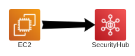

## Openscap testing env for Red Hat Image Builder images

## Warning Security Hub must be enabled and prowler must be accepted in the integrations tab

This project will create a testing environment in AWS that runs vunerability scans on an EC2 instance whose AMI was created by Red Hat's Image Building tool 

## High level diagram

## References

- https://aws.amazon.com/blogs/security/how-to-automate-scap-testing-with-aws-systems-manager-and-security-hub/
- https://github.com/bugbiteme/demo-tform-aws-vpc